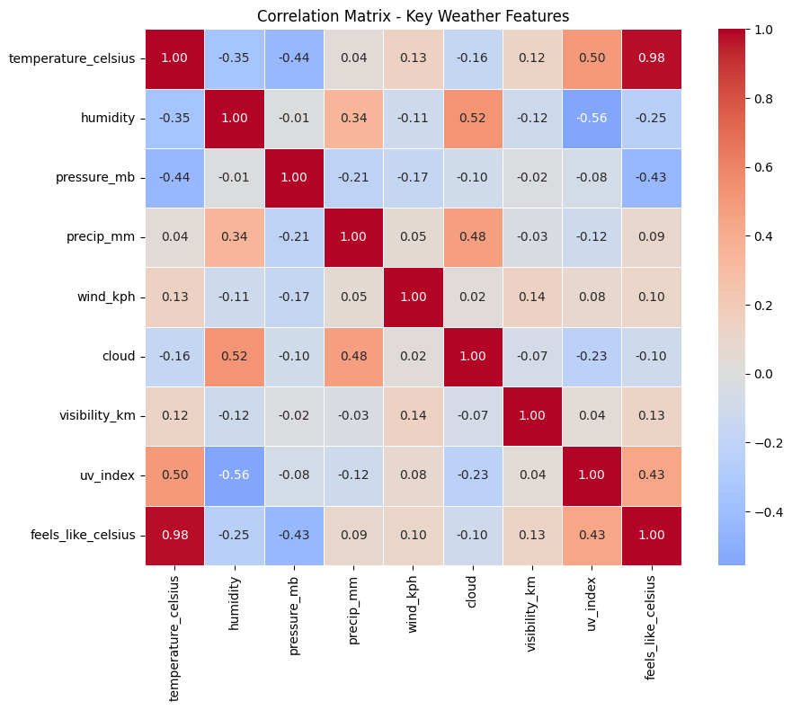
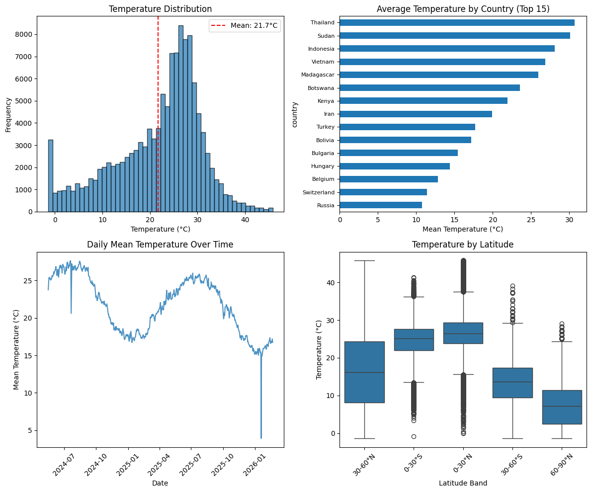
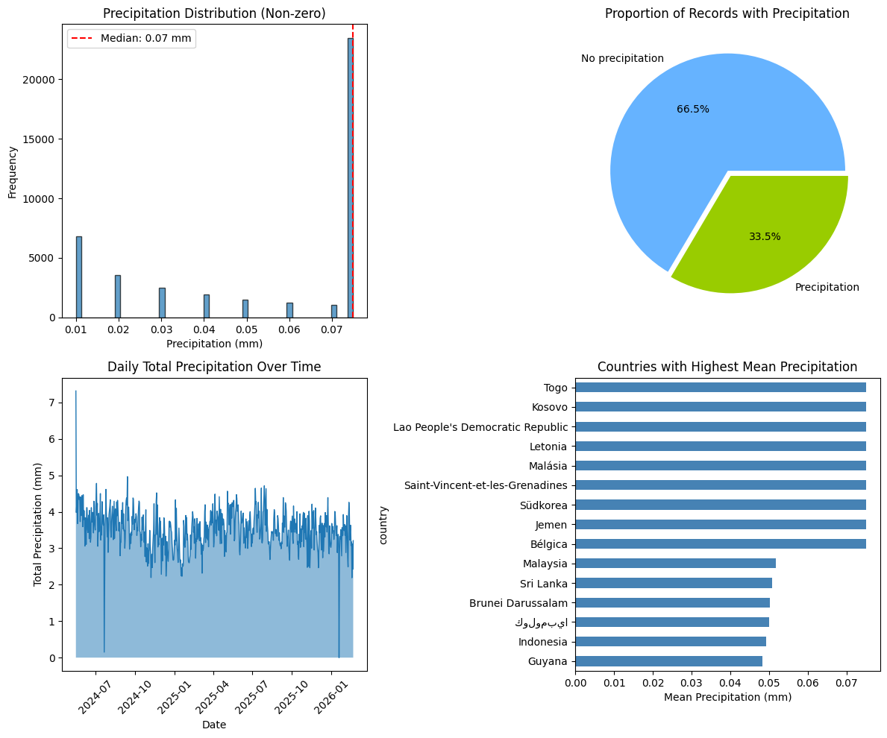
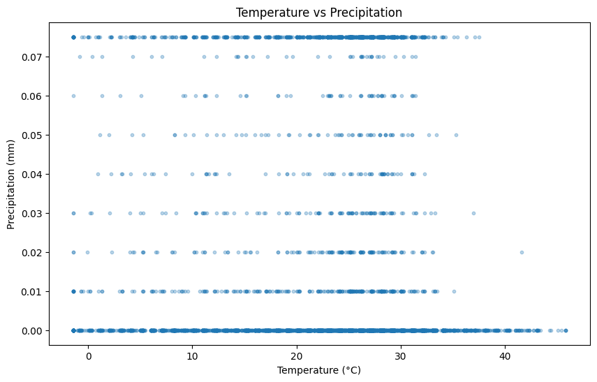
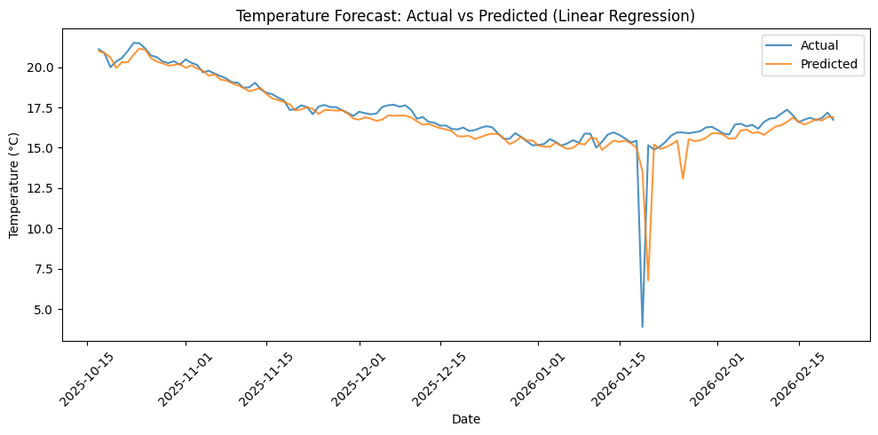
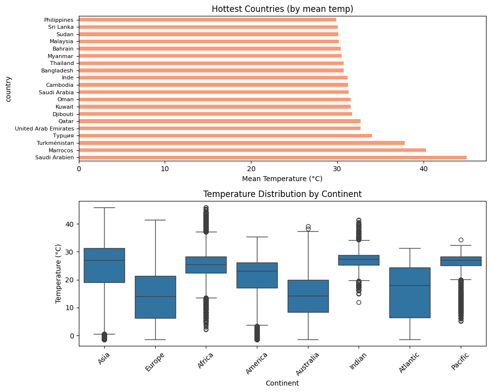

# Weather Trend Forecasting

**PM Accelerator Mission**

> By making industry-leading tools and education available to individuals from all backgrounds, we level the playing field for future PM leaders. This is the PM Accelerator motto, as we grant aspiring and experienced PMs what they need most – **Access**. We introduce you to industry leaders, surround you with the right PM ecosystem, and discover the new world of AI product management skills.

---

## Project Overview

This project analyzes the **Global Weather Repository** dataset to build weather trend forecasting models. The work is organized into a basic assessment (data cleaning, EDA, simple models) and an advanced assessment (anomaly detection, multiple models, ensemble methods, and domain-specific analyses).

**Dataset:** 125,501 records × 41 columns covering daily weather for cities worldwide (temperature, precipitation, wind, pressure, humidity, air quality, geography).

---

## Basic Assessment

### 1. Data Cleaning & Preprocessing

#### Load and Explore
- **Shape:** 125,501 rows × 41 columns (23 float64, 7 int64, 11 object)
- **Missing values:** None in the raw dataset
- **Columns:** Geographic (country, location_name, latitude, longitude, timezone), temporal (last_updated), weather (temperature, precipitation, wind, pressure, humidity, cloud, visibility, UV index), and air quality metrics

#### Missing Values & Data Quality
- No missing values required imputation in this dataset
- **Visibility fix:** The `visibility_km` column was derived from `visibility_miles × 1.60934` because the raw values had poor variation (often capped at 10)

#### Outlier Handling (IQR Winsorization)
Outliers were capped at Q1 − 1.5×IQR and Q3 + 1.5×IQR rather than removed:

| Variable           | Outliers | % of Data |
|--------------------|----------|-----------|
| precip_mm          | 23,453   | 18.69%    |
| pressure_mb        | 3,935    | 3.14%     |
| gust_kph           | 3,330    | 2.65%     |
| temperature_celsius| 2,720    | 2.17%     |
| wind_kph           | 2,184    | 1.74%     |
| uv_index           | 222      | 0.18%     |

#### Normalization
- **Standardized (Z-score):** mean = 0, std = 1 — for regression models
- **Min-Max:** scaled to [0, 1] — for algorithms requiring bounded inputs
- **Date range:** 2024-05-16 to 2026-02-21

---

### 2. Exploratory Data Analysis (EDA)

#### Key Statistics
- **Temperature:** range -1.4°C to 45.8°C, mean 21.7°C
- **Precipitation:** 33.5% of records have precipitation; mean 0.05 mm when > 0

#### Correlation Analysis



The correlation heatmap of key weather features shows:

- **Strong positive (0.98):** `temperature_celsius` and `feels_like_celsius` — nearly identical; `feels_like` was excluded in later models to avoid redundancy
- **Strong positive (0.50):** temperature and `uv_index`
- **Positive (0.52):** humidity and cloud; **(0.48):** precip_mm and cloud
- **Strong negative (-0.56):** humidity and uv_index
- **Moderate negative (-0.44):** temperature and pressure_mb
- **Weak:** temperature vs humidity (-0.35), temperature vs precip (0.04)

These correlations guide feature selection and support physical interpretation (e.g., humidity vs UV).

#### Temperature Visualizations



1. **Distribution:** Left-skewed; peak around 25–28°C; mean 21.7°C; notable counts near 0°C
2. **By Country (top 15):** Thailand highest (~29°C), followed by Sudan, Indonesia, Vietnam; Russia, Switzerland, Belgium lowest
3. **Over Time:** Seasonal cycles with peaks ~25–27°C in mid-year and troughs ~17°C; sharp dip to ~5°C in early 2026
4. **By Latitude:** Tropical bands (0–30°N/S) warmest (~25–28°C median); temperate (30–60°N/S) cooler; polar (60–90°N) coldest (~5°C median)

#### Precipitation Visualizations



1. **Distribution (non-zero):** Right-skewed; high frequency at 0.07 mm (median)
2. **Proportion:** 66.5% no precipitation, 33.5% with precipitation
3. **Daily Total Over Time:** Mostly 2–4 mm/day with occasional spikes
4. **By Country:** Togo, Kosovo, Laos, Malaysia, South Korea, Belgium among highest mean precipitation

#### Temperature vs Precipitation



- Dense horizontal band at 0 mm across all temperatures
- Non-zero precipitation in discrete bands (~0.01–0.07 mm)
- No strong linear relationship — precipitation occurs across the full temperature range

---

### 3. Model Building (Basic Forecasting)

#### Time Series Setup
- **Aggregation:** Daily mean temperature (and other aggregates) from `last_updated`
- **Features:** `temp_lag1`, `temp_lag7`, `day_of_year`, `month`
- **Shape:** 639 days (2024-05-23 to 2026-02-21)
- **Split:** Time-based (no shuffling) for temporal validation

#### Model Comparison

| Model            | MAE    | RMSE   | MAPE (%) | R²    |
|------------------|--------|--------|----------|-------|
| Linear Regression| 0.47   | 1.22   | 4.30     | 0.665 |
| Random Forest    | 0.84   | 1.51   | 7.22     | 0.486 |

**Best model:** Linear Regression (higher R², lower MAE, RMSE, MAPE)

#### Actual vs Predicted (Linear Regression)



The Linear Regression model tracks the actual temperature well for most of the period. Around mid-January 2026, both actual and predicted show a sharp cold snap; the model slightly over-predicts the severity and lags the recovery, but overall captures seasonal trends effectively.

---

## Advanced Assessment

### 1. Advanced EDA — Anomaly Detection

We use **Isolation Forest** (tree-based) and **Local Outlier Factor (LOF)** (density-based) to identify unusual weather records that may represent extreme events, sensor errors, or data quality issues.

#### Results

| Metric | Value |
|--------|-------|
| Isolation Forest anomalies | 6,275 (5.00%) |
| LOF anomalies | 6,275 (5.00%) |
| Both methods agree on normal | 114,599 (91.3%) |

#### Example Anomalies

**Cold extremes** (standardized temperature ≈ -2.5): Canberra (Australia), Santiago (Chile), Astana (Kazakhstan), Ulaanbaatar (Mongolia), Ottawa (Canada) — consistent with winter extremes in temperate/polar cities.

**High precipitation** (standardized precip ≈ 1.9): Andorra La Vella, Nuku'alofa (Tonga), Sofia (Bulgaria), Majuro (Marshall Islands), Belgium — heavy rain events across varied climates.

#### Key Insights

- Anomalies typically correspond to **extreme weather**: very cold/hot temperatures, heavy precipitation, unusual pressure
- 6,275 records (5.00%) flagged as anomalous
- Both methods agree on the same 5% contamination rate; 91.3% of records are unanimously classified as normal

---

### 2. Forecasting with Multiple Models

#### Setup

- **Time series:** 639 days × 8 features
- **Train:** 511 samples | **Test:** 128 samples
- **Features:** `temp_lag1`, `temp_lag7`, `day_of_year`, `month`, etc.

#### Individual Model Comparison

| Model | MAE | RMSE | MAPE (%) | R² |
|-------|-----|------|----------|-----|
| Linear Regression | 0.470 | 1.217 | 4.30 | 0.665 |
| Ridge | 0.470 | 1.216 | 4.30 | 0.666 |
| Random Forest | 0.842 | 1.508 | 7.22 | 0.486 |
| Gradient Boosting | 0.809 | 1.478 | 7.01 | 0.506 |
| XGBoost | 0.893 | 1.533 | 7.52 | 0.469 |

Linear models (Linear Regression, Ridge) clearly outperform tree-based models for this time series task, with lower MAE, RMSE, MAPE and higher R².

#### Ensemble Results

| Model | MAE | RMSE | MAPE (%) | R² |
|-------|-----|------|----------|-----|
| Linear Regression | 0.470 | 1.217 | 4.30 | 0.665 |
| Ridge | 0.470 | 1.216 | 4.30 | 0.666 |
| Random Forest | 0.842 | 1.508 | 7.22 | 0.486 |
| Gradient Boosting | 0.809 | 1.478 | 7.01 | 0.506 |
| XGBoost | 0.893 | 1.533 | 7.52 | 0.469 |
| **Ensemble (Simple Avg)** | 0.503 | 1.174 | 4.89 | **0.688** |
| **Ensemble (Weighted Avg)** | **0.471** | **1.149** | **4.66** | **0.702** |

**Best model:** **Ensemble (Weighted Avg)** — R² 0.702, RMSE 1.149, MAPE 4.66%. The weighted average (by inverse RMSE) improves over any single model by combining predictions.

---

### 3. Unique Analyses

The advanced notebook includes four domain-specific analyses:

1. **Climate analysis** — Long-term temperature trends and temperature by latitude (climate zones)
2. **Environmental impact** — Air quality metrics vs weather variables (correlation heatmap)
3. **Feature importance** — Random Forest and permutation importance; `feels_like_celsius` excluded as redundant
4. **Spatial & geographical patterns** — Temperature and precipitation by 5°×5° grid, by country, and by continent



---

## Repository Structure

```
├── 01_basic_assessment.ipynb    # Data cleaning, EDA, basic models
├── 02_advanced_assessment.ipynb # Anomaly detection, multi-model, unique analyses
├── datasets/
│   ├── GlobalWeatherRepository.csv
│   └── basic_assessment/        # data_cleaned.csv, data_standardized.csv, data_normalized.csv
├── assets/
│   ├── basic_assessment/        # Report figures (correlation, EDA, forecast plots)
│   └── advanced_assessment/     # Anomaly, model comparison, unique analyses
├── requirements.txt
└── README.md
```

